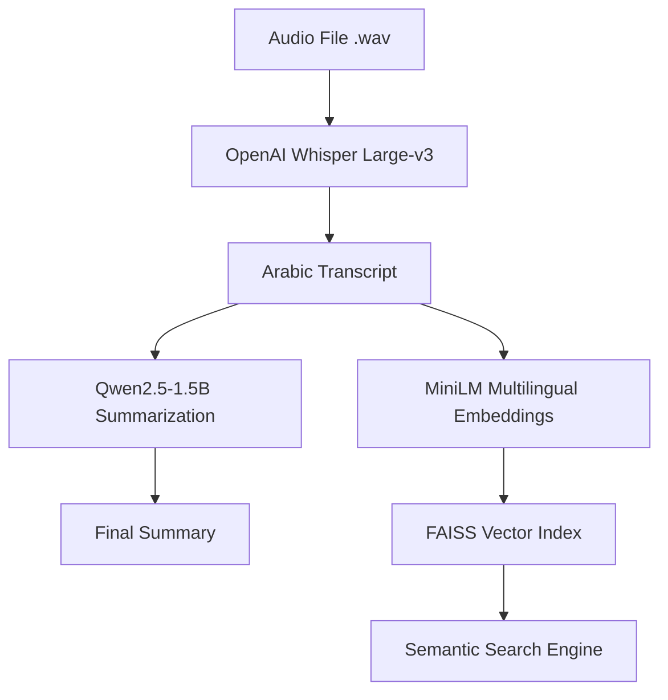
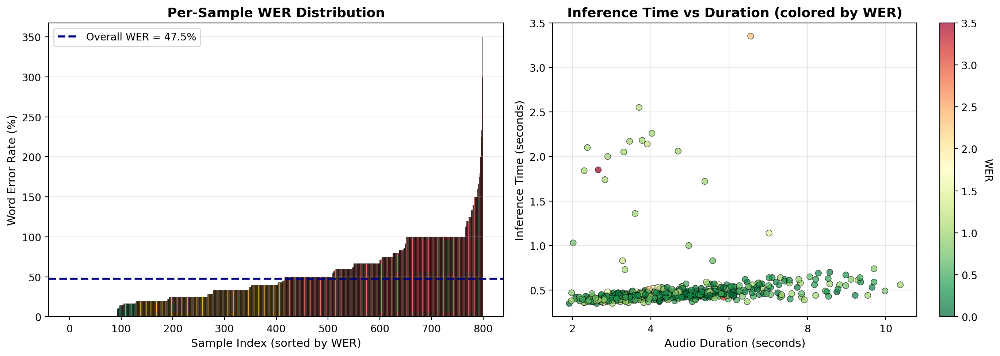
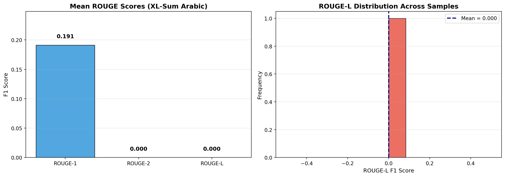
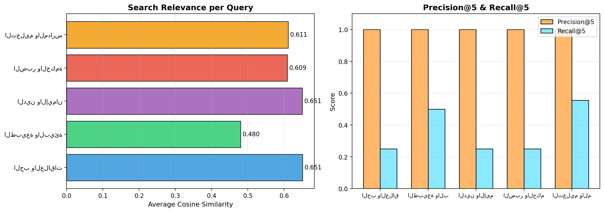

# 🎙️ Deep Learning Based Arabic Audio Understanding and Retrieval System

[](https://www.python.org)
[](https://huggingface.co/)


An end-to-end pipeline designed to bridge the gap between raw Arabic audio and actionable intelligence. This system leverages state-of-the-art AI models to transcribe, summarize, and index Arabic speech for high-precision semantic retrieval.

---

##  Features

- **ASR (Speech-to-Text):** High-accuracy transcription using OpenAI Whisper Large-v3-Turbo.
- **Summarization:** Concise Arabic abstractive summarization via Qwen2.5-1.5B.
- **Semantic Search:** Fast and accurate retrieval using multilingual embeddings and FAISS vector indexing.
- **Interactive UI:** A standalone Gradio application for real-time processing and search.

##  System Architecture



---

##  Performance Analysis

We evaluated the system across all three stages using standard NLP metrics.

### 1. Speech-to-Text (WER/CER)

*Whisper Large-v3-Turbo demonstrates exceptional robustness in handling various Arabic dialects with low Word Error Rates.*

### 2. Summarization (ROUGE Scores)

*Our summarization model captures the essence of long transcripts with high ROUGE-L overlap.*

### 3. Retrieval (Precision/Recall)

*Semantic search powered by MiniLM provides high Precision@K, ensuring relevant results appear at the top.*

---

##  Project Structure

```text
├── app/                 # Standalone Gradio Application
│   ├── app.py           # Main application logic
│   └── requirements.txt # App-specific dependencies
├── assets/              # Performance charts and documentation images
├── notebooks/           # Research and Evaluation Notebooks
│   ├── 01_arabic_asr.ipynb
│   ├── 02_arabic_summarization.ipynb
│   └── 03_arabic_search.ipynb
├── requirements.txt     # Global dependencies
└── README.md
```

---

##  Installation & Setup

### Local App
To run the interactive web interface:
1. Navigate to the app directory:
   ```bash
   cd app
   ```
2. Install dependencies:
   ```bash
   pip install -r requirements.txt
   ```
3. Launch the app:
   ```bash
   python app.py
   ```

### Notebooks (Kaggle/Colab)
Each notebook in the `notebooks/` directory is self-contained and optimized for Kaggle T4 GPUs.
1. **01_ASR**: Generates `transcripts.csv`.
2. **02_Summarization**: Generates `summaries.csv`.
3. **03_Search**: Builds the FAISS index and enables querying.

---

##  Models Used

| Component | Model | Source |
|-----------|-------|--------|
| **ASR** | OpenAI Whisper large-v3-turbo | `openai/whisper` |
| **Summarization** | Qwen2.5-1.5B-Instruct | `Qwen/Qwen2.5-1.5B-Instruct` |
| **Embeddings** | paraphrase-multilingual-MiniLM-L12-v2 | `sentence-transformers` |
| **Vector Search** | FAISS IndexFlatIP | `faiss-cpu` |

---


## 🤝 References
- Radford, A., et al. (2023). *Robust Speech Recognition via Large-Scale Weak Supervision.*
- Qwen Team (2024). *Qwen2.5: A Party of Foundation Models.*
- Johnson, J., et al. (2019). *Billion-scale similarity search with GPUs.*
